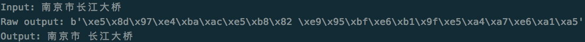

# Jieba Op for Tensorflow

## Intro
 
This is a tensorflow wrapper for the cpp version of the famous Chinese
word segmentation tool, [cppjieba](https://github.com/yanyiwu/cppjieba).

I made some changes from the original cppjieba. This is 
[my fork of cppjieba](https://github.com/applenob/cppjieba).

Most code of this repo are from Didi's deep learning language platform:
[Delta](https://github.com/didi/delta)

## Install

```bash
pip install tf-jieba
```

## Usage

1. Clone the cppjieba repository for resource files like model and dict
   files.

```bash
git clone https://github.com/applenob/cppjieba.git
```

2. Download or copy the test python script `custom_test.py` to the same
   project. You should have `cppjieba` and `custom_test.py` under your
   test directory now.

```
python3 custom_test.py
```

Demo output:



## Support Platform 

- python == 3.6
- tensorflow >= 1.14.0
- OS: MacOS / Linux